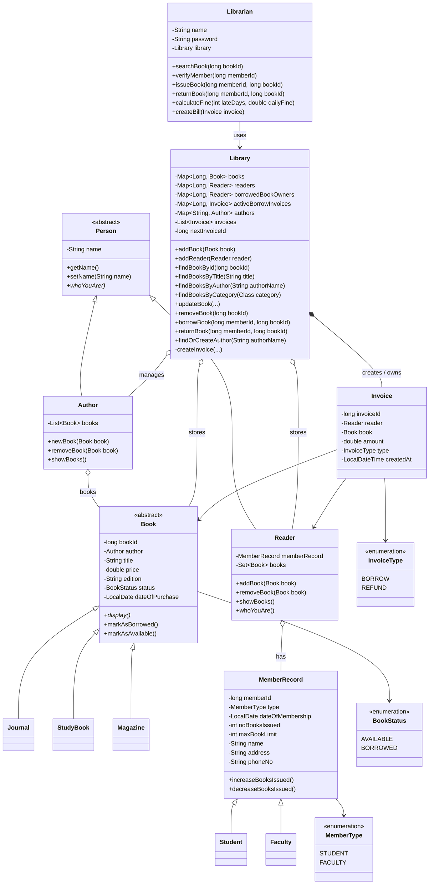

# Java OOP Library System

Java ile Object-Oriented Programming prensipleri kullanılarak geliştirilmiş bir konsol tabanlı kütüphane otomasyon sistemidir.

Projenin amacı inheritance, abstraction, polymorphism, encapsulation, composition ve Java Collections yapılarının gerçek bir problem üzerinde uygulanmasıdır.

---

## Proje Kurulumu

Projeyi fork edip bilgisayarınıza clone edin.

```bash
git clone <repository-url>
```

Projeyi IntelliJ IDEA veya tercih ettiğiniz bir Java IDE'si ile açın.

Uygulamayı çalıştırmak için:

```text
src/org/example/Main.java
```

dosyasındaki `main` metodunu çalıştırın.

Uygulama konsol üzerinden çalışmaktadır ve kullanıcı işlemleri `Scanner` aracılığıyla alınmaktadır.

---

# Library System

Sistem bir kütüphane otomasyonunu modellemektedir.

Kullanıcılar sisteme eklenebilir, kitaplar yönetilebilir, kitaplar ödünç alınabilir ve geri teslim edilebilir.

Bir kitap ödünç alındığında kullanıcı için bir fatura oluşturulur. Kitap geri getirildiğinde ise ödünç alınırken ödenen ücret kullanıcıya refund işlemiyle iade edilir.

---

## Kullanılan OOP Prensipleri

### Encapsulation

Sınıflardaki alanlar `private` olarak tanımlanmıştır.

Nesnelerin durumları gerekli getter, setter ve davranış metotları üzerinden kontrol edilmektedir.

Örneğin:

- `Book`
- `Person`
- `Reader`
- `MemberRecord`
- `Library`
- `Invoice`

---

### Inheritance

Projede birden fazla inheritance ilişkisi bulunmaktadır.

```text
Person
├── Author
└── Reader

Book
├── Journal
├── StudyBook
└── Magazine

MemberRecord
├── Student
└── Faculty
```

---

### Abstraction

Projede iki abstract sınıf bulunmaktadır:

- `Person`
- `Book`

`Person` sınıfında:

```java
public abstract void whoYouAre();
```

`Book` sınıfında:

```java
public abstract void display();
```

metotları bulunmaktadır.

Alt sınıflar bu davranışları kendi yapılarına göre override etmektedir.

---

### Polymorphism

Kitap nesneleri `Book` referansı üzerinden kullanılmaktadır.

Örneğin:

```java
Book book;

book = new Journal(...);
book = new StudyBook(...);
book = new Magazine(...);
```

Kitaplar görüntülenirken:

```java
book.display();
```

çağrısı yapılmaktadır.

Böylece çalışma zamanında gerçek nesnenin override ettiği `display()` metodu çalışmaktadır.

---

### Composition

`Library` ile `Invoice` arasında composition ilişkisi bulunmaktadır.

Invoice nesneleri doğrudan `Library` sınıfı içerisinde bulunan private:

```java
createInvoice(...)
```

metodu tarafından oluşturulmaktadır.

Oluşturulan faturalar yine `Library` içerisinde tutulmaktadır.

Bu nedenle `Library`, oluşturduğu `Invoice` nesnelerinin yaşam döngüsünü yönetmektedir.

---

### Aggregation / Association

`Reader` bir `MemberRecord` nesnesine sahiptir.

Ancak `MemberRecord`, `Reader` dışında oluşturulup constructor aracılığıyla verildiği için bu ilişki aggregation olarak değerlendirilmiştir.

Benzer şekilde `Library`, kitapları, okuyucuları ve yazarları yönetmektedir.

---

# Class Hierarchy Diagram



---

# Kullanılan Veri Yapıları

## List

`Author` sınıfı yazarın kitaplarını saklamak için:

```java
List<Book>
```

kullanmaktadır.

`Library` sınıfı oluşturulan faturaları saklamak için:

```java
List<Invoice>
```

kullanmaktadır.

---

## Set

`Reader` sınıfında kullanıcının ödünç aldığı kitaplar:

```java
Set<Book>
```

ile saklanmaktadır.

`HashSet` kullanıldığı için aynı kitabın aynı kullanıcıya tekrar eklenmesi engellenmektedir.

---

## Map

Sistemin temel verileri `Library` içerisinde Map yapıları ile tutulmaktadır.

```java
Map<Long, Book> books;
Map<Long, Reader> readers;
Map<Long, Reader> borrowedBookOwners;
Map<Long, Invoice> activeBorrowInvoices;
Map<String, Author> authors;
```

Bu yapılar sayesinde kitap, kullanıcı, yazar ve ödünç alma işlemlerine hızlı şekilde erişilebilmektedir.

---

# Kitap Durumları

Kitapların durumu `BookStatus` enum'u ile yönetilmektedir.

```java
AVAILABLE
BORROWED
```

Yeni eklenen kitaplar varsayılan olarak:

```text
AVAILABLE
```

durumundadır.

Kitap ödünç alındığında:

```text
BORROWED
```

durumuna geçmektedir.

Kitap geri getirildiğinde tekrar:

```text
AVAILABLE
```

olmaktadır.

---

# Member Types

Kütüphane üyeleri:

```text
STUDENT
FACULTY
```

olarak iki farklı türde oluşturulabilmektedir.

Bunun için:

```java
Student extends MemberRecord
Faculty extends MemberRecord
```

yapısı kullanılmaktadır.

---

# Invoice System

Kitap ödünç alındığında:

```text
BORROW
```

tipinde bir invoice oluşturulmaktadır.

Kitap geri teslim edildiğinde:

```text
REFUND
```

tipinde yeni bir invoice oluşturulmaktadır.

Refund miktarı kitabın daha sonra değişebilecek güncel fiyatından değil, kitabın ödünç alındığı anda oluşturulan BORROW invoice tutarından alınmaktadır.

---

# Kullanıcı Kitap Limiti

Her kullanıcının aynı anda ödünç alabileceği maksimum kitap sayısı:

```text
5
```

olarak belirlenmiştir.

Bu değer `MemberRecord` içerisinde:

```java
maxBookLimit = 5;
```

şeklinde tutulmaktadır.

Kullanıcı 5 kitap limitine ulaştığında yeni bir kitap ödünç alamaz.

---

# Author Management

Aynı yazar adına sahip kitapların farklı `Author` nesnelerine bölünmesini engellemek için yazarlar `Library` içerisinde:

```java
Map<String, Author>
```

ile tutulmaktadır.

Yeni kitap eklenirken:

```java
findOrCreateAuthor(...)
```

metodu kullanılır.

Eğer yazar sistemde zaten varsa mevcut `Author` nesnesi kullanılır.

---

# Console Operations

Uygulama başladığında aşağıdaki menü gösterilir:

```text
===== LIBRARY SYSTEM =====

1 - Add Book
2 - Search Book
3 - Update Book
4 - Delete Book
5 - List Books By Category
6 - List Books By Author
7 - Add Reader
8 - Borrow Book
9 - Return Book
0 - Exit
```

---

# Sistem Özellikleri

Sistem üzerinden aşağıdaki işlemler gerçekleştirilebilir:

- Yeni kitap ekleme
- Kitabı ID ile arama
- Kitabı title ile arama
- Kitabı yazar adı ile arama
- Kitap bilgilerini güncelleme
- Kitap silme
- Belirli kategorideki kitapları listeleme
- Belirli yazara ait kitapları listeleme
- Student veya Faculty kullanıcı oluşturma
- Kitap ödünç alma
- Kitabın hangi kullanıcıda olduğunu takip etme
- Kitap geri teslim etme
- Ödünç alma faturası oluşturma
- İade sırasında refund oluşturma
- Kullanıcı başına maksimum 5 kitap kontrolü
- Aynı kitap ID'sinin tekrar eklenmesini engelleme
- Aynı kullanıcı ID'sinin tekrar eklenmesini engelleme
- Yanlış sayı ve tarih girişlerinde uygulamanın kapanmasını engelleyen input validation

---

# Input Validation

Konsol girişleri güvenli yardımcı metotlar üzerinden alınmaktadır.

```java
readInt(...)
readLong(...)
readDouble(...)
readDate(...)
```

Örneğin kullanıcı sayı beklenen bir alana harf girerse uygulama kapanmaz ve kullanıcıdan tekrar geçerli bir değer istenir.

Tarih formatı:

```text
DD-MM-YYYY
```

şeklindedir.

Örnek:

```text
05-06-2026
```

---

# Package Structure

```text
src
└── org
    └── example
        ├── Main.java
        │
        ├── enums
        │   ├── BookStatus.java
        │   ├── InvoiceType.java
        │   └── MemberType.java
        │
        └── model
            ├── Author.java
            ├── Book.java
            ├── Faculty.java
            ├── Invoice.java
            ├── Journal.java
            ├── Librarian.java
            ├── Library.java
            ├── Magazine.java
            ├── MemberRecord.java
            ├── Person.java
            ├── Reader.java
            ├── Student.java
            └── StudyBook.java
```

---

# Proje Gereksinimleri

Projede istenen temel gereksinimler karşılanmıştır:

- Object-Oriented Design
- Encapsulation
- Composition
- Inheritance
- Abstract Classes
- Polymorphism
- List
- Set
- Map
- Minimum 10 sınıf
- Console Application
- Kitap CRUD işlemleri
- Kitap arama
- Kategoriye göre listeleme
- Yazara göre listeleme
- Kitap ödünç alma
- Kitap geri teslim etme
- Kitabın hangi kullanıcıda olduğunu takip etme
- Invoice oluşturma
- Refund işlemi
- 5 kitap limiti
- Class hierarchy diagram

---

## Technologies

- Java
- Java Collections Framework
- Java Time API
- IntelliJ IDEA
- Object-Oriented Programming